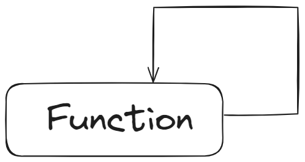

# Definition

>[!NOTE]
>It is a technique where a function calls upon itself during an operation



# How does it work?

A recursive function comprises: 
1. Recursive expressions
2. Conditional statements:
	- Terminate the recursion
	- Keep the recursion going

*Snippet A: Factorial example*

```python
def factorial(n: int) -> int:
	return 1 if n == 0 else n * factorial(n-1)
```

The factorial of a number, $n$, goes like this:

$$n! = n(n-1)(n-2)...(3)(2)(1)$$

From this sequence of number, it can be deduced that the conditional statement is n \== 0. The condition can also be $n \; > 0 \text{ or } n \geq 1$. 

If the conditional statement is:
1. `if n == 0: `
	- The recursion will be terminated when n is 0. Otherwise, call the function again. 
2. `if n > 0:` or `if n >= 1:`
	- The recursion will keep going until n is lesser than 1. (The function will keep calling itself)

Once it reaches the end, the function will begin to retrace itself back to the beginning. 


# Pros and Cons

## Advantages

1. Reduce the number of lines 
2. Makes lines of codes easier to read

## Disadvantages

1. Less efficient compared to iterative metthod
2. Stack overflow errors.

*Snippet C: stack overflow*

```cpp
int Even(int n){
	return !Odd(n);
}
int Odd(int n){
	return !Even(n);
}
```