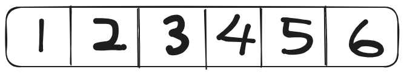

# Array definition

Arrays created in C++ can only hold values of the same datatype. 

```cpp
int main(){
	// array that can only hold integer datatype is created
	int arr[5]{1,2,3,4,5};
	// array that can only hold string values
	std::string names[5]{"Bob", "Charles"};
	return 0;
}
```

Arrays are contiguous. This means that the values are next to each other.



When you create an array, a pointer will be created that points to the first value in the array. The variable name of the array is the pointer that points to the first value. Because the name isn't a modifiable lvalue, it is not possible to change the variable name to point to another location. However, you can actually assign a pointer variable to the array.

*Snippet*
```cpp
int main(){
	int arr[5]{1,2,3,4,5};
	// A pointer that points to the first element has been created. 
	int *pArr{arr};
	
	return 0;
}
```

The values inside an array can be assigned through random access; the compiler does not have to traverse from location 0 to location n to access the value at n. This is also known as subscript notation, `arr[3]`

## Creating array 

**The conventional way**

```cpp
int main(){
	int arr[5]{1,2,3,4,5};
	// A pointer that points to the first element has been created. 
	int *pArr{arr};
	
	return 0;
}
```

**Allocating memory manually**

```cpp
int main(){
	int* pArr{ new int[5] };
	
	for(int index{0}; index < 5; index++)
		pArr[i] = index+1;
		
	return 0;
}
```

# 2-Dimensional Array

A 2D array is an array that stores arrays as its element. A conventional thought is to imagine it as a table. 

| row/column | 0   | 1   | 2   | 3   |
| ---------- | --- | --- | --- | --- |
| 0          | 1   | 6   | 9   | 8   |
| 1          | 1   | 8   | 6   | 7   |
| 2          | 6   | 8   | 5   | 9   |
| 3          | 1   | 2   | 3   | 4   |
| 4          | 9   | 8   | 7   | 2   |

According to the table above, the 2D array contains 5 rows and 4 columns. 

Assessing the values in a specific row and column requires two indices. `arr[0][1]`. The first index indicates the row while the second index indicates the column. `arr[0][1]` would return 1.

If only one index is indicated, a list (*row*) will be returned. `arr[0]` will return `[1,6,9,8]`

## Creating 2D array

**The conventional way**

```cpp
int main(){
	int 2darray[4][4]{};
	for(int index{0}; index < 4; index++){
		for(int index2{0}; index2 < 4; index2++)
			adarray[index][index2] = index2+1;
	}
	return 0;
}
```

**Allocating memory manually**

```cpp
int main(){
	// Allocate memory for row
	int** p2darray{new *int[4]};
	// Replace this with for loop
	// Allocate memory for column
	p2darray[0] = new *int[4];
	p2darray[1] = new *int[4];
	p2darray[2] = new *int[4];
	p2darray[3] = new *int[4];
	
	for(int index{0}; index < 4; index++){
		for(int index2{0}; index2 < 4; index2++)
			p2darray[index][index2] = index2+1;
	}
	
	return 0;
}
```

### Traversing 2d array effectively

Traversing a matrix to find a value by check is cell one by one is ineffective as it takes $O(n^2)$ time. What if the value is at the bottom left corner? The better way would be:

*Snippet*

```cpp
bool traverseMatrix(int arr[][], int target){
	int row{sizeof(arr)/sizeof(arr[0])};
	int column{sizeof(arr[0])/sizeof(int)};
	int Trow{};
	int Tcolumn{column-1};
	while(Trow< row and Tcolumn >= 0){
		if (arr[Trow][Tcolumn] == target)
			return 1;
		(arr[Trow][Tcolumn] < target) ? row++; column--;
	}
	return 0;

}
```

# Reallocating array

The problem with ordinary array is that it is a static array. This means that the size of the array cannot be changed after its initial setting. So, the developer is restricted to his initial thought. Nonetheless, the developer may allocated more memory for the array but, if it's not utilised completely, a lot of memory is wasted. 

This begs the question, *what if the developer needs more space?*

## Solution - Creating another list

One of the solution is to simply create another list and import the original list over. 

*Snippet*

```cpp
#include <iostream>
#include <cstdlib>
int main(){
	int *plist = new (int *[3]); // 12 bytes of memory is created
	if (!plist) // If there is not enough memory
		return 1;
	 
	plist[0] = 1;
	plist[1] = 2;
	plist[2] = 3;
	
	int *temp = new(int *[4]);
	if(!tmp)
		return 1;
	for(int i{ 0 }; i < 3; i++ )
		list[i] = tmp[i];
	tmp[3] = 4;
	
	delete plist; // removing the previous memory allocated
	plist = temp; // turning temp back to list	
	
	return 0;
}
```

If the list is small, this is a viable way of reallocating memory. However, if the list gets too big, this method is slow and memory-inefficient. This issue can be solved with dynamic array such as `std::vector` or [linked list](Chapter%202%20-%20Linked%20List.md)