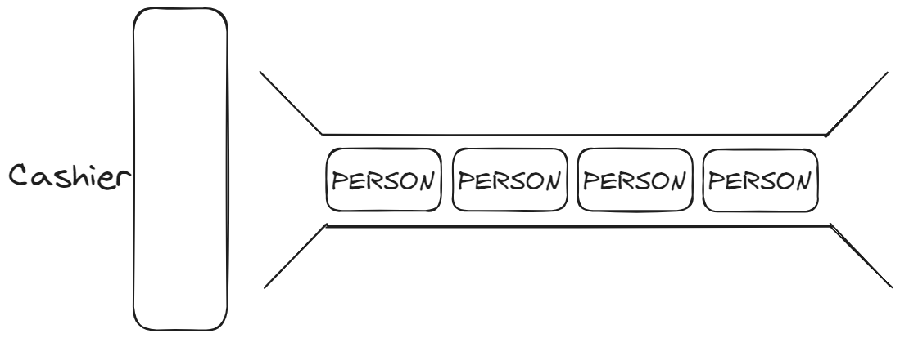

>[!WARNING]
>[Linked List](../Notes/Chapter%202%20-%20Linked%20List.md)

# Queue

Imagine a line at a restaurant down the block. The first person in the line gets served first and leaves. As more people join the line, you notice each person stand behind the succeeding line. There are no acts of cutting in line. This is known as queue. The first person that arrives gets served first and leaves first. The last person that arrives gets served and leaves last. 



This phenomenon is better known as *FIFO* and *LILO*

>[!NOTE]
>*FIFO: First in first out*
>- This means the first data that enters the queue is the first data to leave the queue.
> 
>*LILO: Last in last out*
>- This means the last data that enters the queue is the last data to leave the queue. 

A graphical representative of a queue is as shown above. A queue may also have a linked list representative. 


## Creation

The node is the same one in linked list:


And

```cpp
class Queue{
	private:
		Node* m_head{};
		Node* m_tail{};
		int m_size{};
	private:
		bool enqueue(const int value); 
		bool dequeue(int& value);
		bool peek(int& value) const;
		bool isEmpty() const;
		int get_size() const;
};
```

## Operations

### `bool enqueue(const int value)`

>[!NOTE]
>Adds new node to the end of the queue. It still takes $O(N)$ in both tail presence and absence.


- [?] If the queue does not have a tail

```cpp
bool Queue::enqueue(const int value){
	Node* new_node { new Node(value) };
	if(!new_node) return 0;
	if(!size)
		m_head = new_node;
	else{
		Node* node { m_head };
		for(int index{1}; index < size; index++)
			node = node->next;
		node->next = new_node;
	}
	m_size++;
	return 1;
}
```

- [?] If the queue has a tail

```cpp
bool Queue::enqueue(const int value){
	Node* new_node { new Node(value) };
	if(!new_node) return 0;
	if(!size) {m_head = new_node; m_tail = new_node;}
	else{
		Node* node { m_head };
		for(int index{1}; index < size; index++)
			node = node->next;
		node->next = new_node;
		m_tail = new_node;
	}
	m_size++;
	return 1;
}
```

### `bool dequeue(int& value)`

>[!NOTE]
> Remove the first node of the list. 

```cpp
bool Queue::dequeue(int& value){
	if(!head) return 0;
	Node* node{ m_head };
	value = head->val;
	m_head = head->next;
	delete node;
	m_size--;
	return 1;
}
```

### `bool peek(int& value)`

>[!NOTE]
>Return the value of the first node. This function does not dequeue the queue. 

```cpp
bool Queue::peek(int& value) const{
	if(!head) return 0;
	value = head->val
	return 1;
}
```

### `bool isEmpty()`

>[!NOTE]
>The function checks where the queue is empty.

```cpp
bool Queue::isEmpty() const{
	return (!head) ? 0 : 1; 	
}
```

### `int get_size()`

>[!NOTE]
>Return the size of the queue.

```cpp
int Queue::get_size() const{
	return size;
}
```

# Stack

Imagine a stack of clothes. Every time you need a piece of clothing, you take it from the top and each time you're finish washing the clothes, you fold and put it on top of the stack. This is known as a stack. The last item in the list is the first item that leaves. The first item in the list is the last item that leaves.

 

This is also known as FILO and LIFO.

>[!NOTE]
>*FILO: First in last out*
>- This means the first data that enters the queue is the last data to leave the queue.
> 
>*LIFO: Last in first out*
>- This means the last data that enters the queue is the first data to leave the queue. 

In terms of linked list, a stack looks just like a queue or an ordinary linked list. The only nuance is that the head points to the top of the stack. Any new nodes is added to the front. Any removal is also done on the first node.

## Creation

The node is the same one in linked list:


And

```cpp
class Stack{
	private:
		Node* m_head{};
		int m_size{};
	private:
		bool push(const int value); 
		bool pop(int& value);
		bool peek(int& value) const;
		bool isEmpty() const;
		int get_size() const;
}
```

## Operations

### `bool push(const int value)`

>[!NOTE]
> Push a node to the top of the stack. 

```cpp
bool Stack::push(const int value){
	Node* new_node { new Node(value) };
	if (!size)
		m_head = new_node;
	else{
		new_node->next = head;
		m_head = new_node
	}
	m_size++;
	return 1;
}
```

### `bool pop(int& value)`

>[!NOTE]
>Removes the node on the top of the stack and return the value.

```cpp
bool Stack::pop(int& value){
	if (!size) return 0;
	Node* temp { head };
	m_head = head->next;
	value = temp->val;
	delete temp;
	m_size--;
	return 1;
}
```

### `bool peek(int& value)`

>[!NOTE]
>Returns the value of the first node without deleting it.

```cpp
bool Stack::peek(int& value) const{
	if (!size) return 0;
	value = head->val;
	return 1;
}
```

### `bool isEmpty()`

>[!NOTE]
>Checks if the stack is empty.

```cpp
bool Stack::isEmpty() const{
	return (size) ? 0 : 1;
}
```
### `int get_size()`

>[!NOTE]
>Returns the size of the stack.

```cpp
int Stack::get_size() const{
	return size;
}
```
# See next
[Binary Tree](../../Trees/Notes/Chapter%201%20-%20Binary%20Tree.md)
