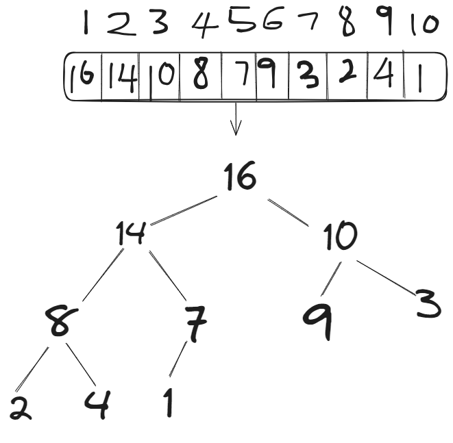
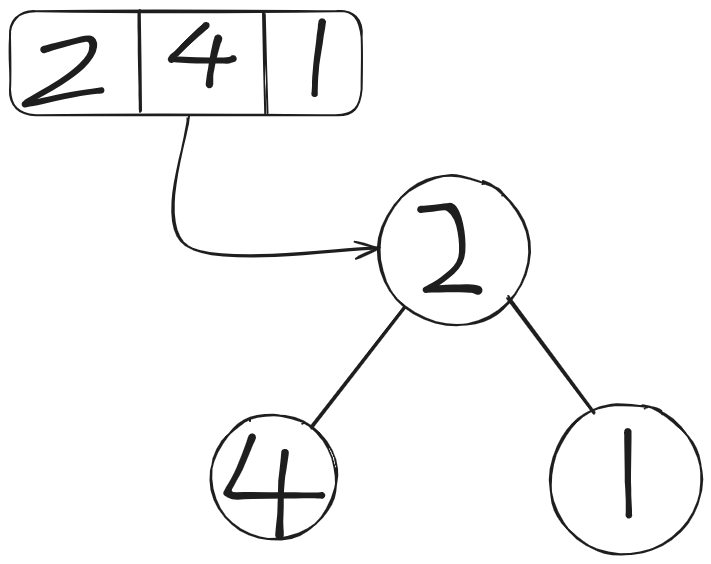

# Heap Definition
>[!WARNING]
>[Binary Tree](../Notes/Chapter%201%20-%20Binary%20Tree.md)
>[Binary Search Tree](../Notes/Chapter%202%20-%20Binary%20Search%20Tree.md)

A heap is a tree-based data structure that satisfies the heap property.

>[!NOTE]
>Max Heap 
>- The value of Parent is either greater than or equal to the value of Child
>
>Min Heap
>- The value of Parent is less than or equal to the value of Child
>

The heap is an efficient implementation of an ADT called priority queue. If it is a max heap, the root is always the largest value; however, if it is a min heap, the root is always the smallest value in the tree. Moreover, a heap is a sorted structure but rather known to be partially sorted. 

>[!FAQ] Operation of priority queue
>insert(S,x): inserts element x into set S.
>max(S): returns the element with the largest key in set S.
>extract_max(S): returns the element with the largest key in set S and removes it.
>update(S,x,k): increases the key of an element to a new key



*Heap visualised*

When it comes to the heap as a tree, the root of the tree is the first element, $i = 1$(*Unrelated to whether the heap is max or min heap.*) The parent of $i$ is $\frac{i}{2}$. The left and right is $2i$ and $2i+1$ respectively. 

>[!TIP] 
>When looking to check if a heap is max heap or min heap, look at the heap from bottom to the top and ignore the leaves.

When is heap useful?
- When it is necessary to remove the object with the highest or lowest value 
- When insertion needed to be interspersed with removals of the root node.

A common implementation of the heap is **binary heap**, where the tree used is a **complete binary tree**. 

>[!NOTE]
>It is a form of tree in which every level except the last, is completely filled, and all the nodes in the final level are as left as possible.

When a heap is an almost complete binary tree, it will have the smallest possible height, $log_a N$. 

# Operations

## Problem statement

When it comes to max heap or min heap, the trivial operation is to find the element with the largest or the smallest key in the heap. However, extracting the max is not a trivial operation as you have to maintain the max heap property. The question is, how will the heap be maintained as it is being modified?



This is neither a max heap nor a min heap. So how are we going to build a max heap from an unsorted array.

## Heap operations

1. build_max_heap
	- Produces a max heap from an unsorted array
2. max_heapify: 
	- correct a single violation of the heap property in a subtree
	- This is done recursively, by checking each node's children. 

### `void heapify(int arr[], int n, int i)`

Assume that the trees rooted at left(i) and right(i) are max heaps.

```cpp
void heapify(int arr[], int n, int i){
	int largest{i};
	int left{2*i + 1};
	int right{2*i + 2};
	if(left < n && arr[left] > arr[largest])
		largerst = left;
	if (right < n && arr[right] > arr[largest])
		largest = right;
	if (largest != i){
		swap(arr[i], arr[largest]);
		heapify(arr, n, i);
	}
}
```

*Time complexity:*$O(log\;n)$


It will swap the number at index 2 with the number at index 5. When that happens, the max heap property is still violated at index 4. So, the function is called again to rectify the violation.

### `build_max_heap(int arr[], int n`

```cpp
void max_heap(int arr[], int n){
	// starts from the back and work your way up to 0
	for (int index { n/2 -1 }; index >= 0; index--)
		heapify(arr, n, index);
}
```

*Time complexity:* $n$

So, why start from $n/2 - 1$. This is because elements in any array at index $n/2 + 1$ to $n$ are all leaves. Since all leaves satisfy the max-heap property, there is not need to iterate through them. Looking back at this array $$[2|4|1]$$

arr\[3/2 - 1\] is arr\[0\] which is 4. $n = 3$ `heapify(arr, 3, 0)` is called. In the function, the largest is 0, left as 1 and right as 2. The condition `if(1 < 3 && arr[1] > arr[0])` is true. The largest is now 1. The second condition, `if(2 < 3 && arr[2] > arr[1])` is false. The largest is still 1. The condition, `if (1 != 0)` is true and the element at index 0 and index 1 is swapped. and the function is called again, `heapify(arr, 3, 0)`.$$[4|2|1]$$

>[!TIP]
>The heapify function for min heap would just be the opposite.

## Time complexity

The time complexity of both functions combined is $O(n \; log \; n)$. The for loop itself is $O(n)$ while the `heapify(arr, n, i)` is takes $O(log \; n)$. However, under careful analysis, the time complexity is actually $O(n)$. Notice that `heapify(arr, n, i)` takes constant time for nodes that are one level above the leaves and in general $O(l)$ time for nodes that are $l$ levels above the leaves. 

$\frac{n}{4}$ nodes with level 1, $n/8$ with level 0,..., 1 node at $log\; n$ level. 

The total amount of work in the for loop can be summarised as $$\frac{n}{4}(1\times c)\;+\;\frac{n}{8}(2\times c)\;+\;\frac{n}{4}(3\times c)\;+...+\; 1(log \; n\; c)$$

$\text{let} \frac{n}{4} = 2^k$
$$2^k(1\times c)\;+\;2^{k-1}(2\times c)\;+\;2^{k-2}(3\times c)\;+...+\; 2^{0}(log \; n\; c)$$
$$2^k c (1+\;\frac{2}{2}\;+\;\frac{3}{2}\;+...+\; \frac{(k+1)}{2^k})$$
This is a convergent series and is bounded by a constant. It doesn't matter if k is small or large. So, finally
$$2^kc(c)$$
$$2^k$$
$$\frac{n}{4}$$
$$n$$

Thus, through thorough analysis, the time complexity is actually $O(n)$.

# Heap Sort

Now that the visualisation of heap in a tree, how it is represented in the form of array, and the respective functions to build a heap have been established, heap sort can now be attempted.

**Steps to do a heap sort**
1. Build max heap from an unordered array $(n)$
2. Find maximum element, A\[i] $O(1)$
3. Swap the elements A\[n\] with A\[i] $O(1)$
	1. Now the max element is at the end of the array
4. Discard node n from the heap and reduce the size of the heap
5. New root is determined  $O(n \; log \; n)$
6. Repeat step 2 until the heap is gone. $n \text{ steps}$

```cpp
void heapify(int arr[], int n, int i){
	int largest{i};
	int left{2*i +1};
	int right(2*i + 2);
	
	if (left < n && arr[left] > arr[largest])
		largest = left;
	if (right < n && arr[right] > arr[largest])
		largest = right;
	if (largest != i){
		swap(arr[i], arr[largest]);
		heapify(arr, n, i)l;
	}
}

void build_max_heap(int arr[], int n){
	for (int index {n/2 - 1}; index <= 0; index--)
		heapify(arr, n, index);
	
	for(int index{n-1}; index <= 0; index--){
	// swap the largest value with the smallest value
		swap(arr[0], arr[index]);
	// Make the heap max heap again. 
		heapify(arr, index, 0);
	}
}
```


**Sorted array:** $[4,2,1]$

The time complexity is $O(n log n)$